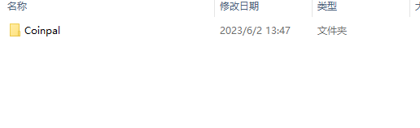
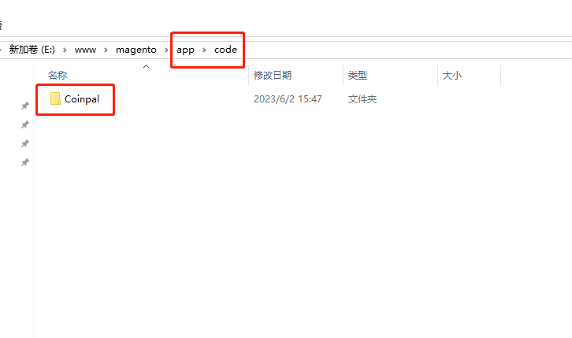
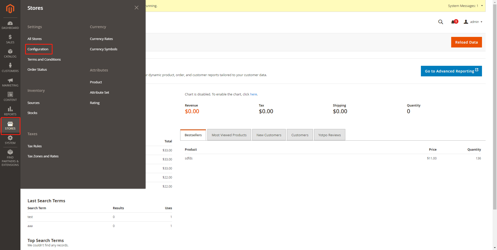
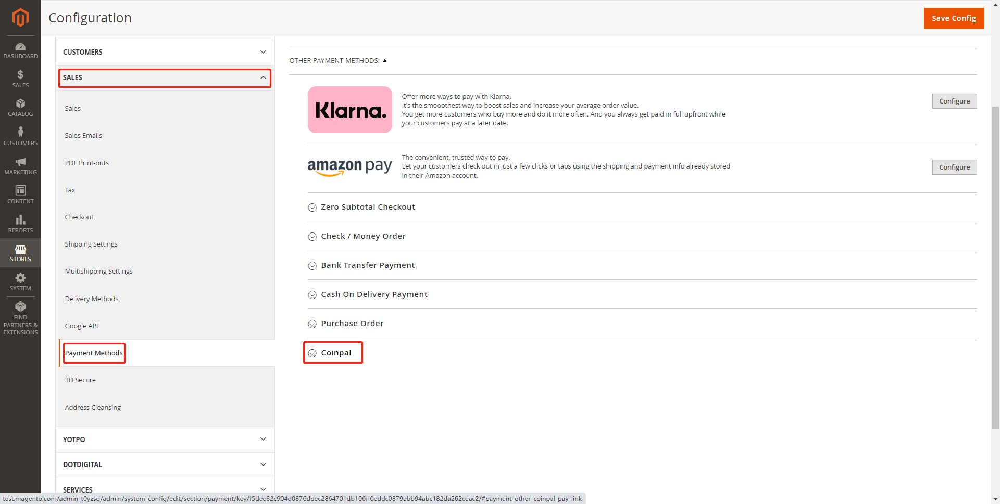
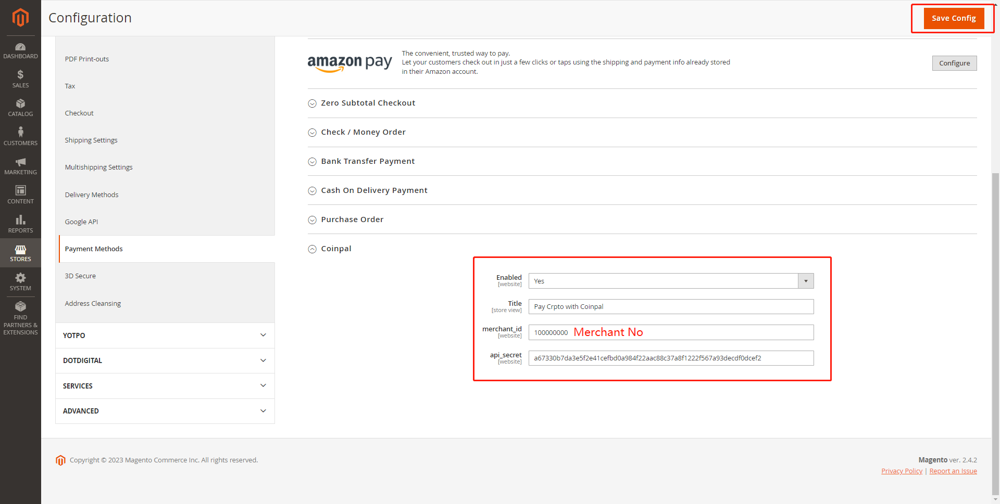
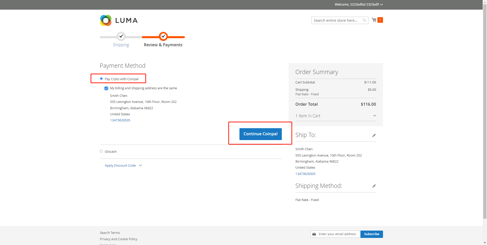

# Magento Coinpal Checkout Installation

## Step 1: Login Coinpal Admin Dashboard get Merchant No and Secret Key.
1. [Register](https://portal.coinpal.io/#/admin/register)/[login](https://portal.coinpal.io/#/admin/login) and go to Coinpal's Admin Dashboard 


2. Follow the Dashboard guidelines to fill in the relevant information

3. Click the 'Integration' button in the lower left corner to get the corresponding Merchant Id and Secret Key


## Step 2: Installing the Coinpal Plugin on your Magento Site.
1. Click the  [Coinpal plug](https://github.com/coinpal-io/plug_magento/blob/master/magento.zip)  Download Coinpal Magento Payment Plug
2. Unzip the magento.zip file and enter the magento folder



3. Copy the Coinpal folder to the Magento root app/code directory



4. In command line, navigate to the magento root folder
Enter the following commands:

```
php bin/magento module:enable Coinpal_Checkout --clear-static-content
php bin/magento setup:upgrade
```

   If the page prompts: "There has been an error processing your request", run the following:
   
```
php bin/magento setup:static-content:deploy -f
```


5. Activate the Coinpal Magento Gateway

    Go to your Magento admin area and click on Stores -> Configuration-> SALES -> Payment Methods

    Find the payment method Coinpal, click Install Module




Copy and Paste all of the Settings you generated in your Coinpal Dashboard on Step #1.

Click Save Config Changes.




## Step 3: Testing your Coinpal Magento Integration.

To confirm your Integration is properly working create a test order:

Add Test Item to Shopping Cart and View Cart.

Proceed to Checkout

Select Pay Crpto with Coinpal as the Payment Method.

Click Continue Coinpal button

If you like you can now proceed to making a test payment.



## Step 4: Marking a Payment as Received on Magento.

Login to your Magento Admin Dashboard.

Go to the Magento Section and Click Orders.

You will see the Test Orders Marked as “Paid”

Verify the Coins are in your chosen Coinpal Wallet (The addresses you input in Step #1.)

You may also use a Block Explorer to verify if the transaction was processed.

After the verification of the above steps is completed, it means that the connection with Coinpal is successful.


